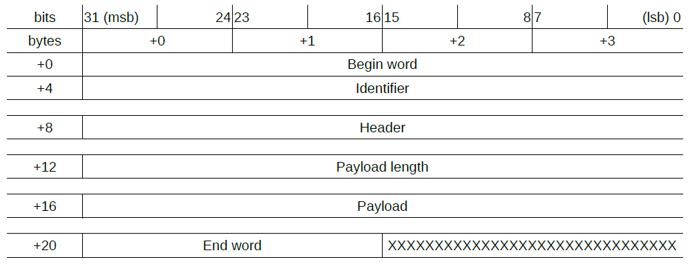

# 1) Presentation

The 

# 2) Download

First you need to download this project on your computer. To do so, you can use the following command line :

```git
git clone -b 2.0-SNAPSHOT https://github.com/Pierre-Emmanuel41/messenger.git --recursive
```

and then double click on the deploy.bat file. This will deploy this project and all its dependencies on your computer. Which means it generates the folder associated to this project and its dependencies in your .m2 folder. Once this has been done, you can add the project as maven dependency on your maven project :

```xml
<dependency>
	<groupId>fr.pederobien</groupId>
	<artifactId>messenger</artifactId>
	<version>2.0-SNAPSHOT</version>
</dependency>
```

# 3) Tutorial

### 3.1) Structure of a message

In order to extract complete answers received from the remote (both client and server side), each message has the following structure:  

The begin word : [98, 105, 110, 27].  
The message identifier (coded on 4 bytes).  
The message header.  
The payload length (coded on 4 bytes).  
The payload.  
The end word: [13, 10].  

Here is the array representation of the structure :



Nota Bene: The values "+12", "+16", "+20" are indicatives values. Indeed the header and the payload length are unknown.

### 3.2) Implementation

The class responsible for generating messages whose structure has been previously introduced is <code>Message</code>. But the developer does not need to use directly this class. Actually, once the header structure has been defined, what really differ from one message to another is the payload. In order to generate the bytes array associated to the payload and to retrieve the payload from the bytes array, the developer needs to implement the interface <code>IMessageInterpreter</code>. It is highly recommended to have one interpreter for one specific message.  
Those interpreters can be stored in a class that implements the <code>InterpretersFactory</code>. Finally, the developer instantiate a <code>MessageFactory</code> with the specific interpreters factory in order to generate messages to send to the remote.

### 3.3) Tutorial

The first interface the developer needs to implement is the <code>IHeader</code>. It is important to implement it first. As example, the header can looks like this:

```java
public class Header implements IHeader<Header> {
	private int code;
	private boolean isError;
	private byte[] bytes;

	public Header() {
		code = -1;
		isError = false;
		bytes = new byte[0];
	}

	public Header(int code, boolean isError) {
		this.code = code;
		this.isError = isError;
		bytes = ByteWrapper.create().putInt(code).put((byte) (isError ? 1 : 0)).get();
	}

	@Override
	public byte[] getBytes() {
		return bytes;
	}

	@Override
	public int getLength() {
		return bytes.length;
	}

	@Override
	public Header parse(byte[] buffer) {
		ByteWrapper wrapper = ByteWrapper.wrap(buffer);
		code = wrapper.getInt(0);
		isError = wrapper.get(4) == 1;
		
		// DO NOT FORGET TO GENERATE THE BYTES ARRAY OTHERWISE THE PAYLOAD WILL NOT BE PARSED CORRECTLY
		bytes = ByteWrapper.create().putInt(code).put((byte) (isError ? 1 : 0)).get();
		return this;
	}
	
	@Override
	public String toString() {
		return "code=" + code + ", isError=" + isError;
	}

	/**
	 * @return The code associated to this header.
	 */
	public int getCode() {
		return code;
	}

	/**
	 * @return True if there is an error, false otherwise.
	 */
	public boolean isError() {
		return isError;
	}
}
```

Then the developer can implement different message interpreters. There are two different interpreters :

```java
public class PlayerNameInterpreter implements IMessageInterpreter {

	@Override
	public byte[] generate(Object[] payload) {
		if (payload.length == 0)
			return new byte[0];

		ByteWrapper wrapper = ByteWrapper.create();

		// First writing the name length, then writing the name.
		wrapper.putString((String) payload[0], true);
		return wrapper.get();
	}

	@Override
	public Object[] interprete(byte[] payload) {
		if (payload.length == 0)
			return new Object[0];

		int first = 0;
		List<Object> informations = new ArrayList<Object>();
		ByteWrapper wrapper = ByteWrapper.wrap(payload);

		// +0: Player name length
		int nameLength = wrapper.getInt(first);
		first += 4;

		// +4: Player name
		String name = wrapper.getString(first, nameLength);
		informations.add(name);

		return informations.toArray();
	}
}
```

```java
public class PlayerAgeInterpreter implements IMessageInterpreter {

	@Override
	public byte[] generate(Object[] payload) {
		if (payload.length == 0)
			return new byte[0];

		ByteWrapper wrapper = ByteWrapper.create();
		wrapper.putString((String) payload[0], true);
		wrapper.putInt((int) payload[1]);
		return wrapper.get();
	}

	@Override
	public Object[] interprete(byte[] payload) {
		if (payload.length == 0)
			return new Object[0];

		int first = 0;
		List<Object> informations = new ArrayList<Object>();
		ByteWrapper wrapper = ByteWrapper.wrap(payload);

		// +0: Player name length
		int nameLength = wrapper.getInt(first);
		first += 4;

		// +4: Player name
		String name = wrapper.getString(first, nameLength);
		informations.add(name);
		first += nameLength;

		// +4 +nameLength: Player age
		int age = wrapper.getInt(first);
		informations.add(age);

		return informations.toArray();
	}
}
```

The next step is to store those interpreters in order to generate bytes and retrieve the payload informations:

```java
public class InterpretersFactoryImpl implements InterpretersFactory<Header> {
	private Map<Integer, IMessageInterpreter> interpreters;

	public InterpretersFactoryImpl() {
		interpreters = new HashMap<Integer, IMessageInterpreter>();
		interpreters.put(0, new PlayerNameInterpreter());
		interpreters.put(1, new PlayerAgeInterpreter());
	}

	@Override
	public IMessageInterpreter get(Header header) {
		return interpreters.get(header.getCode());
	}
}
```

And finally, the developer can instantiate the message factory and use it to generate bytes:

```java
public static void main(String[] args) {
		MessageFactory<Header> factory = new MessageFactory<>(new InterpretersFactoryImpl());

		IMessage<Header> messageName = factory.create(new Header(0, false), "Player 1");
		System.out.println(messageName);
		System.out.println(ByteWrapper.wrap(messageName.getBytes()));

		IMessage<Header> responseName = factory.parse(new Header(), messageName.getBytes());
		System.out.println(responseName + "\n");

		IMessage<Header> messageAge = factory.create(new Header(1, true), "Player 1 ", 20);
		System.out.println(messageAge);
		System.out.println(ByteWrapper.wrap(messageAge.getBytes()));

		IMessage<Header> responseAge = factory.parse(new Header(), messageAge.getBytes());
		System.out.println(responseAge);
	}
```

Whose the output is:

```java
{bin,identifier={0},header={code=0, isError=false},Payload={Player 1}}
[98,105,110,27,0,0,0,0,0,0,0,0,0,0,0,0,12,0,0,0,8,80,108,97,121,101,114,32,49,13,10]
{bin,identifier={0},header={code=0, isError=false},Payload={Player 1}}

{bin,identifier={1},header={code=1, isError=true},Payload={Player 1 ,20}}
[98,105,110,27,0,0,0,1,0,0,0,1,1,0,0,0,17,0,0,0,9,80,108,97,121,101,114,32,49,32,0,0,0,20,13,10]
{bin,identifier={1},header={code=1, isError=true},Payload={Player 1 ,20}}
```